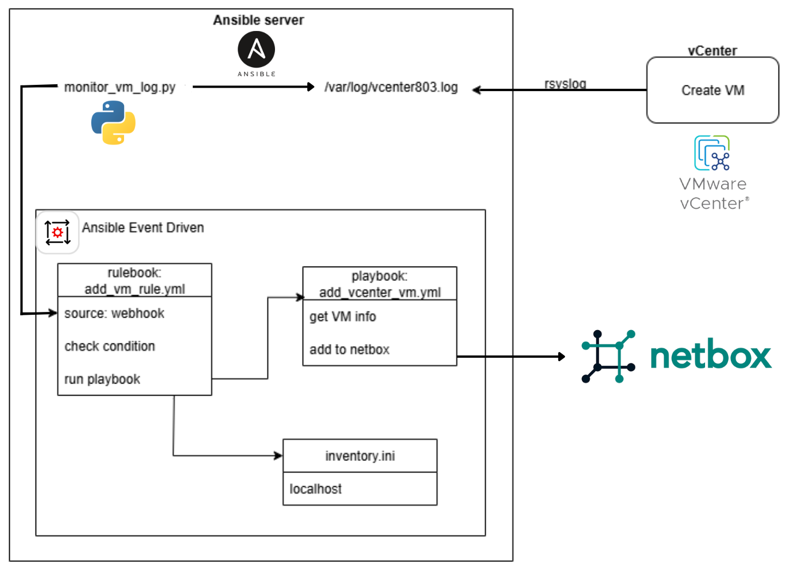

# Ansible EDA with VMware vCenter Lab
This repository showcases a **simple lab project** that integrates two powerful tools:

- **Ansible Event-Driven Automation (EDA)** → provides the **automation engine** that reacts to events (e.g., VM creation/deletion).  
- **NetBox** → serves as the **infrastructure source of truth**, keeping track of virtual machines and resources.  

The lab demonstrates how these tools can be combined to build an event-driven workflow:  
- When a VM is **created** or **deleted** in **VMware vCenter**,  
- **Ansible EDA** detects the event and automatically runs a playbook,  
- The playbook updates **NetBox** to reflect the new infrastructure state.

  

---

## 🚀 Features
- Detect when a new Virtual Machine (VM) is created in vCenter logs.  
- Trigger an Ansible EDA **rulebook** to automatically run a playbook.  
- Playbook action: add the newly created VM into **NetBox** inventory.  
- Example Python **plugin source** for reading logs and extracting VM names.  

---

## 📂 Repository Structure
```
ansible-eda-vcenter-lab/
│── README.md # Project documentation
│── docs/
│ └── architecture.png # Lab architecture diagram
│── ansible/
│ ├── playbooks/
│ │ └── add_vm_to_netbox.yml
│ ├── rulebooks/
│ │ └── detect_new_vm.yml
│ └── roles/
│ └── netbox_vm/...
│── plugins/
│ └── sources/
│ └── vcenter_log.py # Custom source plugin
│── examples/
│ └── demo_log.txt # Sample log file

```
---

## 🏗️ Architecture


- **VMware ESXi + vCenter**: virtualization platform.  
- **Ubuntu Ansible Control Node**: runs Ansible & EDA.  
- **NetBox**: acts as the source of truth for infrastructure inventory.  

---

## ⚙️ Requirements
- VMware vCenter (lab environment)  
- Ansible 2.15+  
- ansible-rulebook (EDA)  
- Python 3.9+  
- NetBox API (for demo integration)  

---

## 🔧 Usage

### 1. Clone repository
```bash
git clone https://github.com/<username>/ansible-eda-vcenter-lab.git
cd ansible-eda-vcenter-lab
